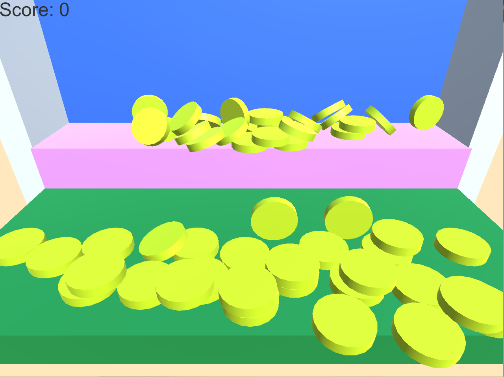

# coin-game

<a href="https://cat4937.github.io/coin-game/" target="_blank">ゲームで遊ぶ</a>

# 遊び方
- スタートを押すとゲーム画面に移行する
- クリックするとランダムでコインが出るのでScoreを増やす
- 初期Scoreは30から始まり、クリックするごとにScoreが-1されます。
- コインが落ちるごとにScoreが+1されます。
- Scoreが0になるとクリックしてもコインは出ないようになっています。
